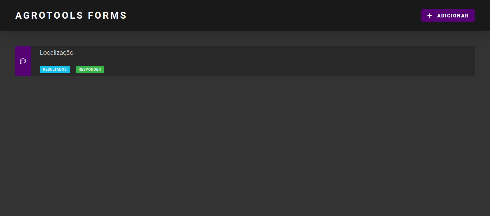

# Agrotools Forms

Um sistema de questionários.

## <a href="https://agrotools-forms.netlify.app">DEMO</a>

API do sistema:<br />
https://github.com/gabriel-cardoso-oliveira/agrotools-forms-server<br />

## Quick start

Install :

```
git clone https://github.com/gabriel-cardoso-oliveira/agrotools-forms-client
```

Test :

```
# Browser
Open the index.html file in the browser
```

<p align="center">
  
</p>